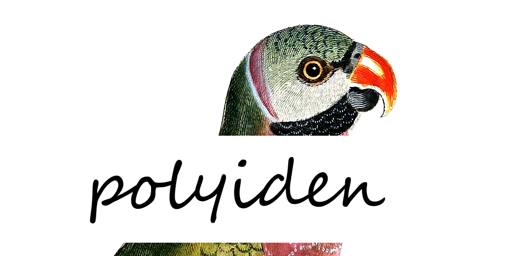

---
output:
  github_document:
    html_preview: true
---

<!-- README.md is generated from README.Rmd. Please edit that file -->

```{r, echo = FALSE}
knitr::opts_chunk$set(
  collapse = TRUE,
  comment = "#>",
  fig.path = "man/figures/README-"
)
```

# polyiden 

[](https://cran.r-project.org/package=polyiden)
[](https://github.com/JonasMoss/polyiden/actions)
[](https://www.repostatus.org/#wip)

An R package for partial identification of polychoric correlations.
```{r setup, include=FALSE}
library("polyiden")
knitr::opts_chunk$set(echo = TRUE)
knitr::opts_chunk$set(out.width='750px', dpi=200)
```

## Installation
Use the following command from inside `R`:
```{r install, echo = TRUE, eval = FALSE}
# install.packages("devtools")
devtools::install_github("JonasMoss/polyiden")
```

## Usage
Call the `library` function, prepare data into matrix form, and run the 
`polyiden` function. 

```{r prepare, echo = TRUE, eval = TRUE}
library("polyiden")
data = psychTools::bfi
data = data[!is.na(data$A4), ]
data = data[!is.na(data$A5), ]
pi = table(data$A4, data$A5) / sum(table(data$A4, data$A5))
pi
        
```

Now you can calculate the partial identification regions assuming normal marginals.
```{r calculate_normal, echo = TRUE, eval = TRUE}
polyiden::polyiden(pi, marginals = "normal")
```

It's also possible to use `"laplace"`, `"uniform"`, and `"exponential"`. Or you
can define your own marginals if you want to.

```{r calculate_laplace, echo = TRUE, eval = TRUE}
polyiden::polyiden(pi, marginals = "laplace")
```

## References
* [Steffen Grønneberg, Jonas Moss & Njål Foldnes. "Partial Identification of Latent Correlations with Binary Data." Psychometrika (2020)](https://www.jstor.org/stable/pdf/2246311.pdf)

## How to Contribute or Get Help
If you encounter a bug, have a feature request or need some help, open a [Github issue](https://github.com/JonasMoss/polyiden/issues). Create a pull requests to contribute. This project follows a [Contributor Code of Conduct](https://www.contributor-covenant.org/version/1/4/code-of-conduct.md).
