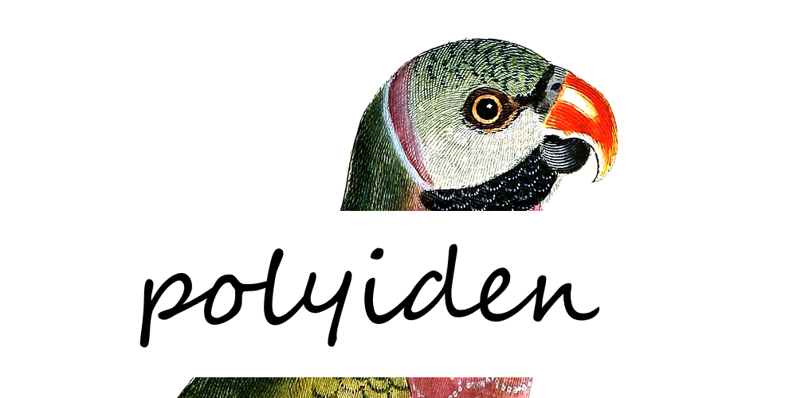

<!-- README.md is generated from README.Rmd. Please edit that file -->

# polyiden 

[](https://cran.r-project.org/package=polyiden)
[](https://github.com/JonasMoss/polyiden/actions)
[](https://www.repostatus.org/#wip)

An R package for partial identification of polychoric correlations.

## Installation

Use the following command from inside `R`:

``` r
# install.packages("devtools")
devtools::install_github("JonasMoss/polyiden")
```

## Usage

Call the `library` function, prepare data into matrix form, and run the
`polyiden` function.

``` r
library("polyiden")
data = psychTools::bfi
data = data[!is.na(data$A4), ]
data = data[!is.na(data$A5), ]
pi = table(data$A4, data$A5) / sum(table(data$A4, data$A5))
pi
#>    
#>               1           2           3           4           5           6
#>   1 0.004339964 0.006509946 0.006871609 0.010488246 0.012296564 0.006148282
#>   2 0.002893309 0.015189873 0.012296564 0.015913201 0.023508137 0.007956600
#>   3 0.002531646 0.004701627 0.013743219 0.020614828 0.018444846 0.006509946
#>   4 0.002531646 0.013743219 0.017721519 0.047016275 0.055696203 0.026401447
#>   5 0.003616637 0.013743219 0.019891501 0.056057866 0.093309222 0.048824593
#>   6 0.005424955 0.013019892 0.020614828 0.071971067 0.145388788 0.154068716
```

Now you can calculate the partial identification regions assuming normal
marginals.

``` r
polyiden::polyiden(pi, marginals = "normal")
#> [1] -0.2624196  0.7602734
```

It’s also possible to use `"laplace"`, `"uniform"`, and `"exponential"`.
Or you can define your own marginals if you want to.

``` r
polyiden::polyiden(pi, marginals = "laplace")
#> [1] -0.3542015  0.7878503
```

## References

  - [Steffen Grønneberg, Jonas Moss & Njål Foldnes. “Partial
    Identification of Latent Correlations with Binary Data.”
    Psychometrika (2020)](https://www.jstor.org/stable/pdf/2246311.pdf)

## How to Contribute or Get Help

If you encounter a bug, have a feature request or need some help, open a
[Github issue](https://github.com/JonasMoss/polyiden/issues). Create a
pull requests to contribute. This project follows a [Contributor Code of
Conduct](https://www.contributor-covenant.org/version/1/4/code-of-conduct.md).
